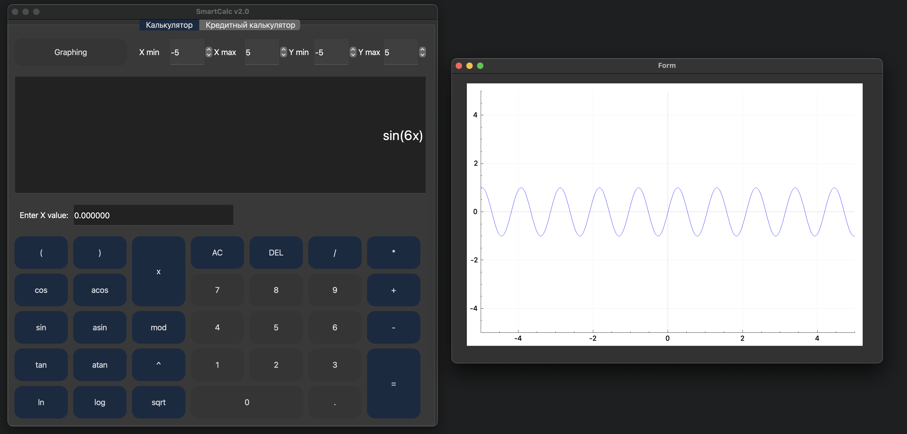

## SmartCalc v2.0

В данном проекте реализована расширенная версия калькулятора на языке программирования С++ в парадигме объектно-ориентированного программирования.
Помимо базовых арифметических операций, как плюс-минус и умножить-поделить, калькулятор имеет возможность вычисления арифметических выражений с учетом приоритетов, а так же некоторыми математическими функциями (синус, косинус, логарифм и т.д.). Помимо вычисления выражений калькулятор поддерживает использование переменной x и построение графика соответствующей функции. В качестве дополнения имеется кредитный калькулятор.

Программа разработана с использованием паттерна проектирования MVC, на языке C++ стандарта C++17, с соблюдением Google Style.
Подготовлено полное покрытие unit-тестами модулей, связанных с вычислением выражений, c помощью библиотеки GTest. 
Сборка программы настроена с помощью Makefile со стандартным набором целей для GNU-программ: all, install, uninstall, clean, dvi, dist, tests. 
Реализация графического пользовательского интерфейса осуществлена на базе Qt.

На вход программы могут подаваться как целые числа, так и вещественные числа, записанные и через точку, и в экспоненциальной форме записи, вычисление производится после полного ввода вычисляемого выражения и нажатия на символ =.
Вычисление произвольных скобочных арифметических выражений в инфиксной нотации. 
Вычисление произвольных скобочных арифметических выражений в инфиксной нотации с подстановкой значения переменной x в виде числа. 
Построение графика функции, заданной с помощью выражения в инфиксной нотации с переменной x  (с координатными осями, отметкой используемого масштаба и сеткой с адаптивным шагом). 

Для реализации калькулятора использован алгоритм Дейкстры для перевода выражений в обратную польскую нотацию.

